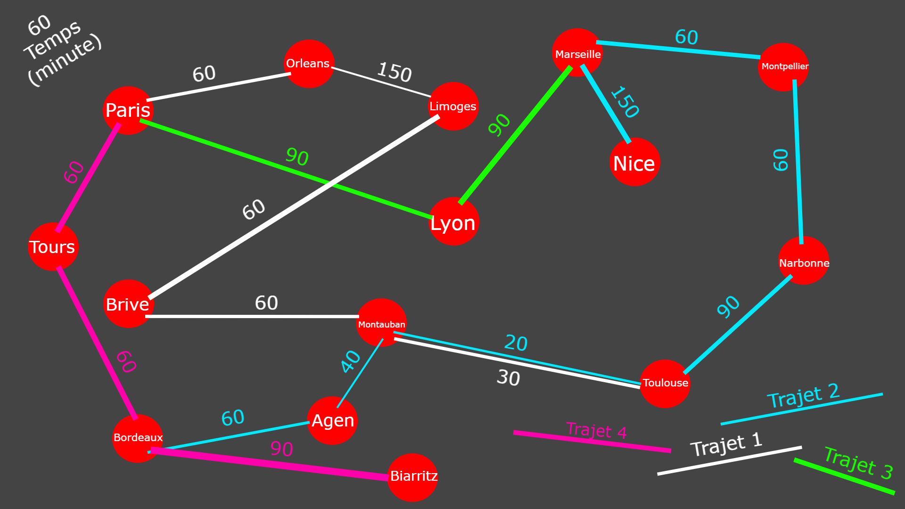

# DOCUMENTATION DU PROJET TCHOU-TCHOU
Projet et documentation entièrement rédigé par Bernat Loan et Gaudillat Eliott

# Sommaire

1. [Introduction et présentation générale](#intro)
2. [Representation du reseau en memoire](#reseau)
    1. [reseau.h](#re)
    2. [reseauAcesseur.h](#reAc)
3. [Naviguation dans le menu](#menu)

## Introduction et présentation générale 

## Representation du reseau routier 

Nous avons choisis de representer le réseau avec un graphe **non orienté**. Une gare représente un sommet, un "chemin" entre deux gares représente une arrête.
Nous n'avons pas tenu compte des "4 trajets initiaux", ils nous ont servis pour relier les villes entre elles et tenir compte de la ponderation. **Par la suite, nous appèlerons "trajets" une arrête entre deux gares.**

Pour représenter ce graphe en mémoire, nous avons utilisés **une liste doublement chainée**, où chaque élement de cette liste est une gare et possède **une liste chainée** d'éléments (correspondants aux chemins de la gare). Pour ce faire nous utilisons 3 structures :
1. struct s_reseau
2. struct s_gare
3. struct s_trajet

Pour sauvegarder et récupérer le réseau entre chaque utilisation du programme, nous utilisons deux fichiers : _reseau.txt_ et _trajet.txt_ dans lesquels nous ecrivons respectivement le nom de l'ensemble des gares du réseau, et l'ensemble des trajets de chaque gare séparé par un '/'.

### Fonction et structure de Gestion du reseau 

**- Reseau** `typedef struct s_reseau* Reseau`

C'est un pointeur sur la structure s_reseau, il va nous permettre d'utiliser de manière dynamique notre réseau !

**- Gare** `typedef struct s_gare* Gare`

C'est un pointeur sur la structure s_gare. Il nous permet de gérer nos gares de manière dynamique.

**- Trajet** `typedef struct s_trajet* Trajet`

C'est un pointeur sur la structure s_trajet. Il nous permet de gérer l'ensemble des trajets de chaque gare de manière dynamique.

**- initReseau** `Reseau initReseau()`

Implémente en mémoire le réseau routier **complet** (avec les gares et les trajets initialisé) à partir de deux fichiers texte.

***Parametre*** : AUCUN

***Retour*** : _Reseau_ un pointeur vers l'emplacement de la racine du reseau en mémoire

**- initGare** `int initGare(Reseau, FILE*)`

Implémente en mémoire une gare dans le réseau routier à partir d'un fichier texte (sauvegarde précédente).

***Parametre*** : _Reseau_ un pointeur vers l'emplacement de la racine du reseau en mémoire, _FILE*_ un pointeur vers le fichier reseau.txt

***Retour*** : 0 si la gare a pu être stockée en mémoire, 1 sinon.

**- initTrajet** `int initTrajet(Gare, FILE*)`

Implémente en mémoire le(s) trajet(s) d'une gare donné en paramètre à partir d'un fichier texte (sauvegarde précédente).

***Parametre*** : _GARE_ La gare à qui appartient le trajet que l'on va entrer en mémoire, _FILE*_ un pointeur vers le fichier trajet.txt

***Retour*** : 0 si le trajet a pu être stocké en mémoire, 1 sinon.

**- sauvReseau** `Reseau sauvReseau(Reseau)`

Sauvegarde dans les fichiers trajet.txt et reseau.txt le réseau routier.

***Parametre*** : _Reseau_ un pointeur vers l'emplacement de la racine du reseau en mémoire

***Retour*** : _Reseau_ un pointeur vers l'emplacement de la racine du reseau en mémoire

**- closeReseau** `void closeReseau(Reseau)`

libère la mémoire prise par le réseau.

***Parametre*** : _Reseau_ un pointeur vers l'emplacement de la racine du reseau en mémoire

___Retour___ : _void_

### Accesseurs sur les structures du reseau

## Naviguation dans le menu 
