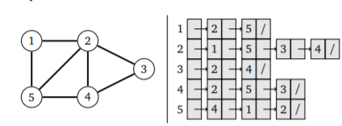

# TCHOU-TCHOU | BERNAT x GAUDILLAT
Projet en structure de donnée. Gestion d'une compagnie de chemin de fer.

# La gestion des Trajets/Gares

## Représentation

Nous avons un total de 15 sommets (gares) et 17 arcs (trajets).

17 << 15² = 225 ; Nous allons procéder avec une liste d'adjacence

Exemple : 

Nous avons cependant des **contraintes** à respecter : 

- La liste des gares doit pouvoir être modifié
- La liste des trajets doit pouvoir être modifié

Propositions de réalisations :
Structure Reseau
Strcuture Gare
Structure Trajet
- Empecher a l'utilisateur d'avoir moins de 2 gares dans son reseau
- Pour enelever une gare il faudrait enlever la gare via son numero d'identifaction (et ces trajets) et retirer tout les trajets dans lequel le numero apparaît
- A chaque debut de programme le reseau s'initialise via "reseau.txt" et "trajet.txt" ecris sous ce format : 

Une liste chainée semble être une bonne idée